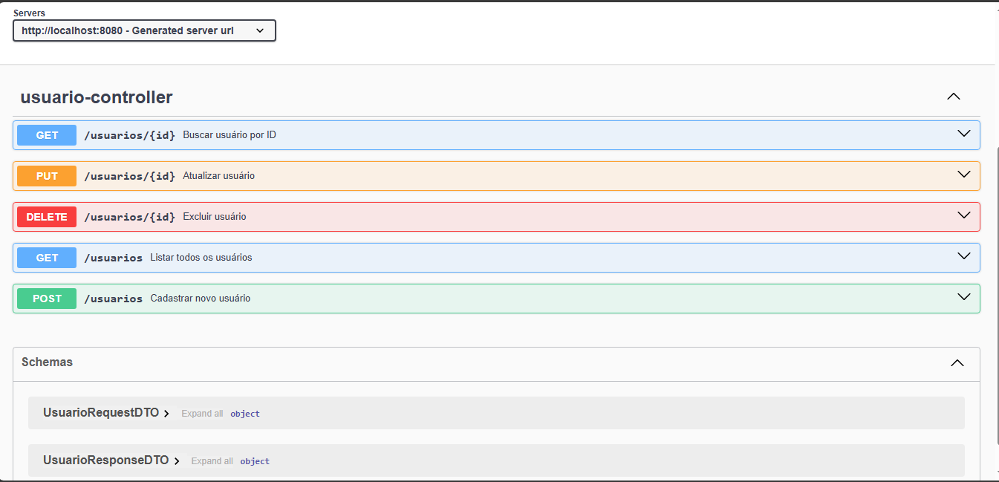

# API Usuário - Spring Boot

## 📌 Sobre o projeto

Este projeto consiste no desenvolvimento de uma API REST para gerenciamento de usuários, construída com Java e Spring Boot.  
O objetivo foi aplicar boas práticas de desenvolvimento backend, organização em camadas e padrões comuns utilizados em aplicações corporativas.

A aplicação implementa operações completas de CRUD, validação de dados, tratamento global de exceções e documentação automática da API.

---

## Objetivo técnico

- Aplicar arquitetura em camadas (Controller, Service, Repository)
- Implementar um CRUD completo de usuários
- Utilizar DTO para transferência de dados
- Trabalhar com persistência utilizando Spring Data JPA
- Implementar validação de dados com Bean Validation
- Criar tratamento global de exceções
- Documentar a API utilizando Swagger / OpenAPI

---

## Tecnologias utilizadas

- Java 17
- Spring Boot
- Spring Web
- Spring Data JPA
- Bean Validation
- Swagger / OpenAPI
- Maven
- MariaDB

---

## Arquitetura do projeto

O projeto segue o padrão de arquitetura em camadas:

Estrutura principal:

- model → Entidades da aplicação
- dto → Objetos de transferência de dados
- repository → Comunicação com banco de dados
- service → Regras de negócio
- controller → Endpoints REST
- exception → Tratamento global de exceções da API
- config → Configurações da aplicação (Swagger / OpenAPI)

  ---

## 🏗 Estrutura do projeto

Organização das camadas da aplicação.

---

## 📚 Documentação da API

A API possui documentação interativa utilizando **Swagger / OpenAPI**, permitindo visualizar e testar os endpoints diretamente pelo navegador.

Após executar a aplicação, acesse: http://localhost:8080/swagger-ui/index.html
### Interface Swagger

## 📡 Exemplo de resposta da API

Exemplo de resposta JSON retornada pela API.

 

## ⚙️ Como executar o projeto

### Pré-requisitos

- Java 17 instalado
- MariaDB instalado e em execução
- IDE compatível com Java 17 (Eclipse, IntelliJ, VS Code, etc.)

---

### Configuração do banco de dados

Este projeto utiliza MariaDB.

É necessário:

1. Criar um banco de dados manualmente.
2. Ajustar as credenciais no arquivo:
